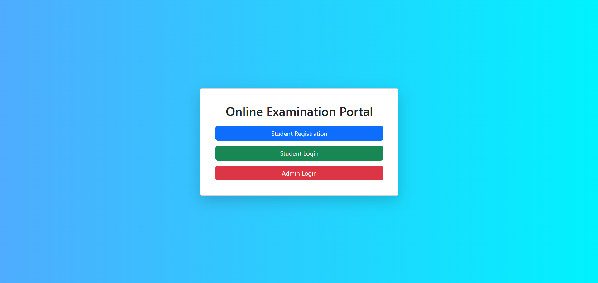
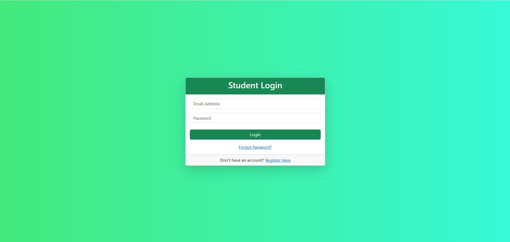
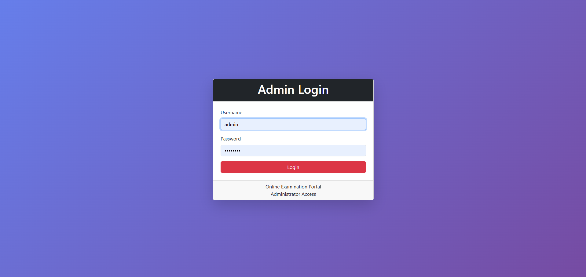
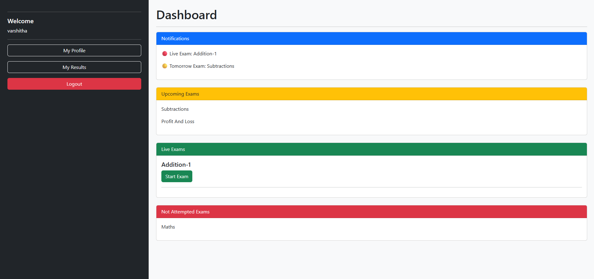
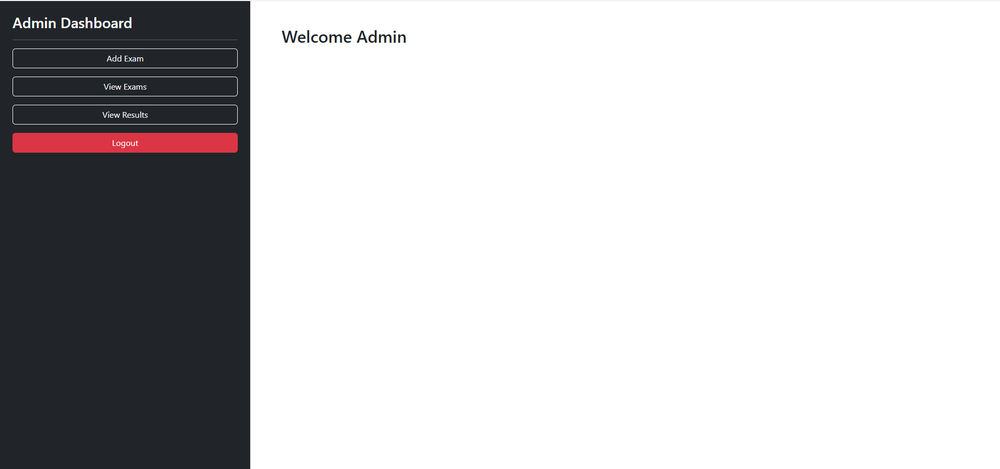
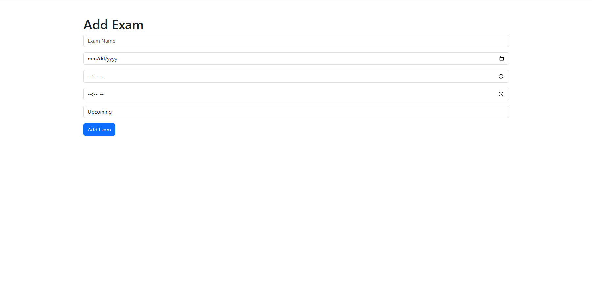
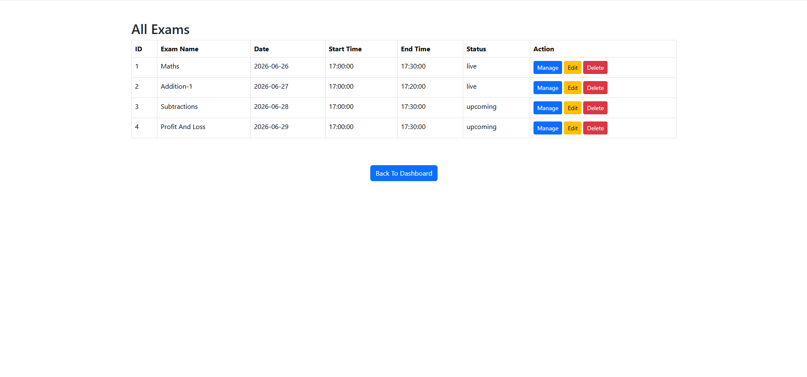

# 🎓 Online Examination Portal

A Flask-based Online Examination Portal that enables administrators to create and manage online examinations while allowing students to securely attend exams and view their results.

---

# 📌 Project Overview

The Online Examination Portal is a web application developed using Flask and MySQL.

It provides two separate modules:

- 👨‍🎓 Student Module
- 👨‍💼 Admin Module

The system allows administrators to create exams, add questions, manage students, and view results.

Students can register, log in, attempt exams within the scheduled time, and view their scores.

---

# ✨ Features

## 👨‍🎓 Student Module

- Student Registration
- Student Login
- Forgot Password using Email OTP
- View Available Exams
- Attempt Online Exams
- Automatic Exam Timer
- Auto Submit After Time Completion
- View Results
- Student Profile

---

---

# 📸 Project Screenshots

## 🏠 Home Page



---

## 👨‍🎓 Student Login



---

## 👨‍💼 Admin Login



---

## 👨‍🎓 Student Dashboard



---

## 👨‍💼 Admin Dashboard



---

## ➕ Add Exam



---

## 📋 View Exams



---

## 📝 Online Examination


---

## 📊 Result Page


## 👨‍💼 Admin Module

- Admin Login
- Add Exams
- View Exams
- Edit Exams
- Delete Exams
- Add Questions
- Edit Questions
- Delete Questions
- View Questions
- View Student Results
- Exam Scheduling (Date & Time)

---

# 🛠 Technologies Used

- Python
- Flask
- MySQL
- HTML5
- CSS3
- Bootstrap 5
- JavaScript

---

# 📂 Project Structure

```
Online-Examination-Portal
│
├── app.py
├── requirements.txt
├── README.md
├── .gitignore
├── templates
├── static
└── screenshots
```

---

# 🚀 Installation

## Clone the Repository

```bash
git clone https://github.com/klu2300032492/Online-Examination-Portal.git
```

## Go to Project Folder

```bash
cd Online-Examination-Portal
```

## Install Dependencies

```bash
pip install -r requirements.txt
```

## Run the Project

```bash
python app.py
```

---

# 🔮 Future Enhancements

- Random Question Generation
- AI-based Question Generator
- Negative Marking
- Performance Analytics
- Online Proctoring
- Certificate Generation

---

# 👥 Team Members

- Koushik Pranav Thari
- Lalitha Mittapalli

B.Tech (Computer Science Engineering)

### Roles
- Lalitha Mittapalli – Frontend Development, Database Design, GitHub Integration
- Koushik – Backend Development, UI Design, Testing & Feature Development